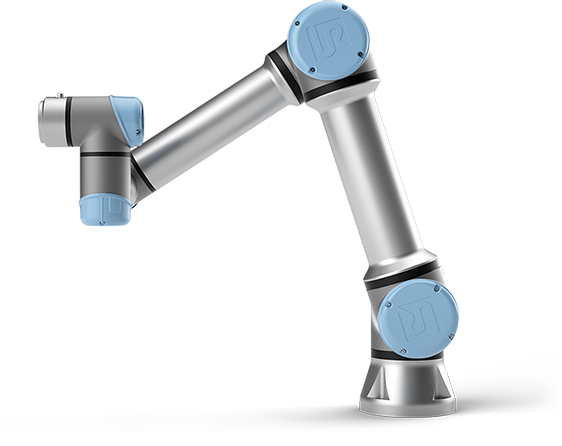

# UR5_Gripper
dRobTek Group 6 - Second semester project for B.E. in Robotics Technology

  

## Problem

A gripper for the Universal Robots UR5 robot is to be developed during this semester project. An idea could be to follow the block diagram below, but not required.

  

It is expected that you at least develop: 
•	A 3D model of a gripper that can be printed or otherwise constructed. 
•	Electronics to control the gripper. 
•	A URCaps plugin for the UR controller. 
•	Software design of a C++ Program developed on a Raspberry PI, a PC, or possibly both. 
•	A modern communication interface to the gripper (e.g. OPC UA). Ideas to an interface: 
•	The no. of grips 
•	Gripper force 
•	Gripper distance 
•	Etc. 
 
The gripper must fulfil the following requirements: 
•	Supply voltage: 24V (from external supply – you are not allowed to use the robot controller as power supply) 
•	The maximum gripper power use: 600mA 
•	It is not allowed to use the digital I/O from the UR robot. All I/O must be done through the Raspberry Pi microcontroller. Please remember that the power output from digital I/O is very limited. 

 

## Introduction

  

 
 

## Abstract

  

 

## Conclusion

